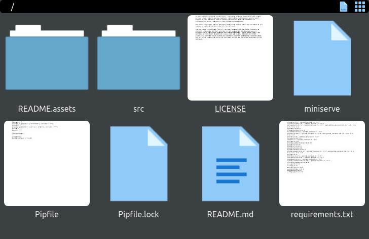
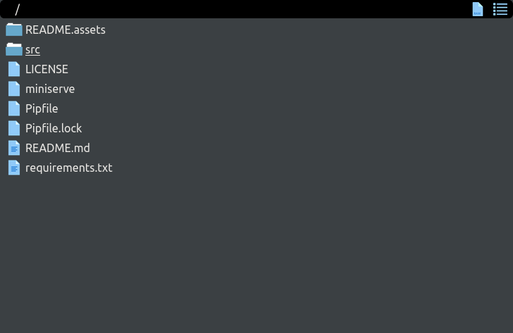

#  miniserve
serve a directory in your local network for view over the browser



## installation

> note: this app was developed and tested under linux. it should also work under windows but was not tested there.
> the installation might differ slightly

```commandline
$ git clone https://github.com/PlayerG9/miniserve.git
# either
$ python3 -m venv .venv
# or
$ python3 -m virtualenv .venv
# then
$ .venv/bin/pip3 install -r requirements.txt
```

and add this line to `~/.bash_aliases`
```bash
alias miniserve='/path/to/miniserve/miniserve'
```

by problems during installation please submit an [issue](https://github.com/PlayerG9/miniserve/issues/new/choose)

for auto-completion in the terminal
copy `scripts/miniserve-completion.sh` to `~/.bash_completion.d/miniserve-completion.sh`
and add the following line to `~/.bashrc` or `~/.bash_aliases`
```bash
source ~/.bash_completion.d/miniserve-completion.sh
```

## running

```commandline
# either
$ /path/to/miniserve/miniserve
# or (if alias is configured)
$ miniserve
```

```commandline
$ miniserve --help
usage: [-h] [-v] [--local] [-p PORT] [--auth [AUTH]] [-w WORKER] [--dotall] [root]

positional arguments:
  root                  directory to serve (default: .)

options:
  -h, --help            show this help message and exit
  -v, --version         show program's version number and exit
  --local               serve only locally (default: 0.0.0.0)
  -p PORT, --port PORT  port to serve on (default: 8000)
  --auth [AUTH]         requires user-login (default: None)
  -w WORKER, --worker WORKER
                        number of workers to use (default: 12)
  --dotall              serve also dot-files (default: False)
```
- **--local** makes miniserve only available on the device it's running on
- **--port** changes the port to run on (recommended ports: 3000, 5000, 8000, 8080)
- **--auth** without further arguments requires the visitor to use the current username and his password (linux only | requires elevated privileges)
- **--auth** with argument requires the visitor to use the current username and `[AUTH]` as password
- **--worker** defines how many threads to use (more threads faster but requires more pc resources) (1..8)
- **--dotall** tells miniserve to serve files that start with `.`

## example screenshots
### list-view


### gallery-view

